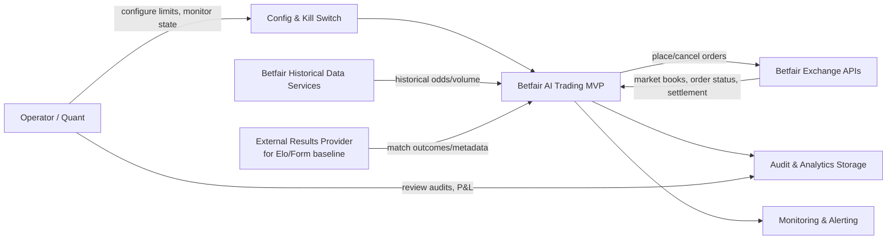

# C4 — System Context

Cross-reference: `03-c4-container.md`, `05-sequence-diagrams.md`.

## Context
The MVP is a pre-match AI-assisted trading system for Betfair Exchange football Match Odds (1X2). It consumes exchange and external baseline data (Elo + form), estimates probabilities, identifies positive net edge, executes orders, and stores complete audit evidence.

## External Interfaces (High-Level)
- Betfair Exchange API for market discovery, market books, and order execution lifecycle.
- Betfair historical data for model development and backtesting.
- External football results feed for Elo and form baselines.

## Context-Level Risks
- External API availability and token expiry.
- Entity resolution mismatch between external match provider and Betfair events.
- Market microstructure changes close to kick-off.

## Checklist
- [ ] Context boundaries are explicit.
- [ ] All external dependencies are monitored.
- [ ] Operator controls are outside trading decision internals.

## References
- Betfair Data Scientists guide
- Betfair Exchange API reference
- Betfair Historical Data Services API