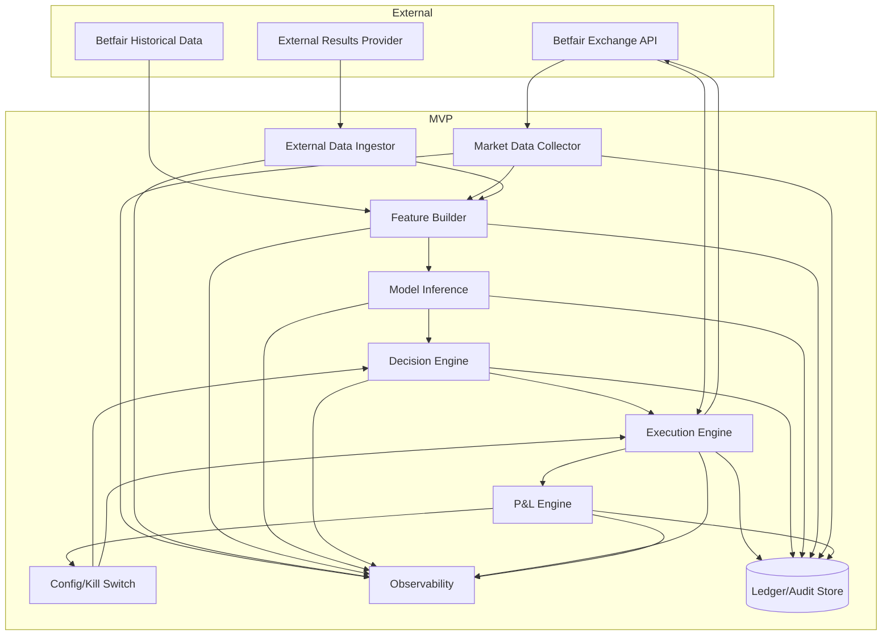

# C4 — Container Diagram

Cross-reference: `02-c4-context.md`, `04-c4-component.md`, `06-data-model.md`.

## Containers
- **Market Data Collector**: discovers markets, polls `listMarketBook`.
- **External Data Ingestor**: computes/loads Elo and form snapshots (as-of).
- **Feature Builder**: merges market and external features into versioned vectors.
- **Model Inference Service**: outputs calibrated 1X2 probabilities.
- **Decision Engine**: computes `p_market`, `edge_net`, applies policy and risk filters.
- **Execution Engine**: submits/cancels orders, reconciliation with current/cleared orders.
- **Ledger/Audit Store**: append-only event records.
- **P&L Engine**: computes realized P&L and bankroll updates.
- **Config/Kill Switch Service**: runtime controls and limits.
- **Observability Stack**: logs/metrics/traces/alerts.

## Container Contracts (Summary)
- `Market Data Collector -> Feature Builder`: market snapshot bundle (`market_id`, odds ladder summary, traded volume, timestamp).
- `External Data Ingestor -> Feature Builder`: as-of Elo/form bundle (`event_key`, team IDs, features, quality flags).
- `Feature Builder -> Model Inference`: feature vector + `feature_set_version` + timestamp.
- `Model Inference -> Decision Engine`: `p_home/p_draw/p_away`, calibration metadata, `model_version`.
- `Decision Engine -> Execution Engine`: intent (`selection`, side, price target, stake, rationale, `decision_id`).
- `Execution Engine -> Ledger`: order lifecycle events keyed by `customerOrderRef`.
- `Execution/Settlement -> P&L Engine`: fills + clearing events for realized P&L.

## Checklist
- [ ] Container boundaries match operational ownership.
- [ ] Contracts include idempotency keys and timestamps.
- [ ] Decision and execution are decoupled via explicit intent/event records.

## References
- Betfair Exchange API reference
- Betfair Data Scientists guide