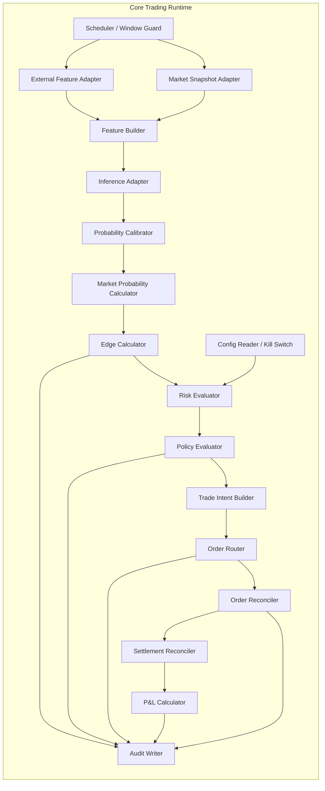

# C4 — Component Diagram (Core Trading Application)

Cross-reference: `03-c4-container.md`, `05-sequence-diagrams.md`, `07-risk-controls.md`.

## Component View
Focus: logical components inside the core trading runtime (Decision + Execution centric).

## Decision Policy Definitions (MVP)

### Market-Implied Probability
For each outcome $i \in \{home,draw,away\}$:
- Choose executable market price proxy (default MVP: mid between best back and best lay where both exist; fallback to best available side).
- Raw implied probability: $\tilde{p}_{market,i} = 1 / odds_i$.
- Normalize over 3 outcomes:
$$
 p_{market,i} = \frac{\tilde{p}_{market,i}}{\sum_j \tilde{p}_{market,j}}
$$

### Net Edge
For candidate bet on outcome $i$:
$$
edge_{gross,i} = p_{model,i} - p_{market,i}
$$
$$
edge_{net,i} = edge_{gross,i} - cost_{commission,i} - cost_{slippage,i}
$$
Where costs are estimated ex-ante using commission schedule and slippage model from spread/liquidity regime.

### Trade Trigger
Trade only if all conditions hold:
1. $edge_{net,i} \ge \theta$ (default MVP threshold configured globally).
2. Liquidity above minimum threshold.
3. Spread below maximum threshold.
4. Time in [T-120, T-10].
5. Risk checks pass.

## Risk Sizing (MVP)
- Fractional Kelly factor: 0.25.
- Stake cap: max 2% of bankroll per market.
- Daily stop-loss: 5% bankroll.
- Max 1 open position per event.

## Checklist
- [ ] Component boundaries expose deterministic inputs/outputs.
- [ ] Every policy decision is persisted with rationale and config snapshot.
- [ ] Risk evaluator can veto regardless of edge.

## References
- Betfair Exchange API reference
- Betfair Commission documentation