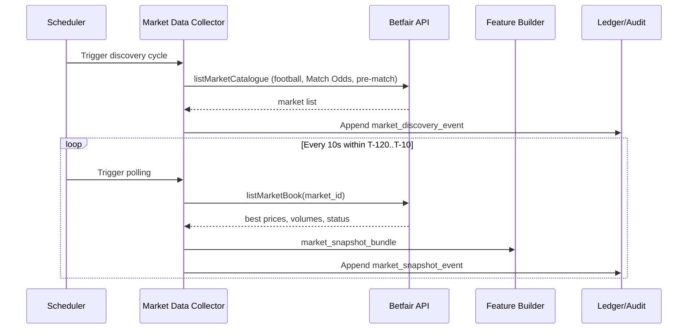
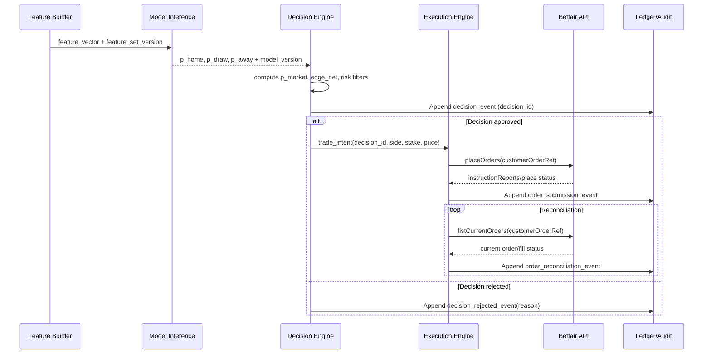
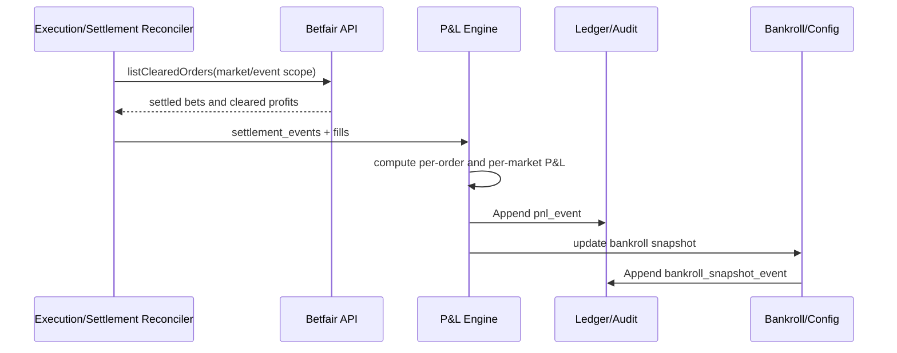

# Sequence Diagrams

Cross-reference: `03-c4-container.md`, `04-c4-component.md`, `06-data-model.md`.

## (a) Market Discovery + Pre-Match Polling

## (b) Decision -> placeOrders -> Reconciliation

## (c) Settlement -> P&L -> Bankroll Update

## Checklist
- [ ] Sequence (a) enforces pre-match time guards.
- [ ] Sequence (b) always writes decision before order submission.
- [ ] Sequence (c) uses clearing data as source of truth for realized P&L.

## References
- Betfair Exchange API reference (`listMarketCatalogue`, `listMarketBook`, `placeOrders`, `listCurrentOrders`, `listClearedOrders`)
- Betfair Data Scientists guide