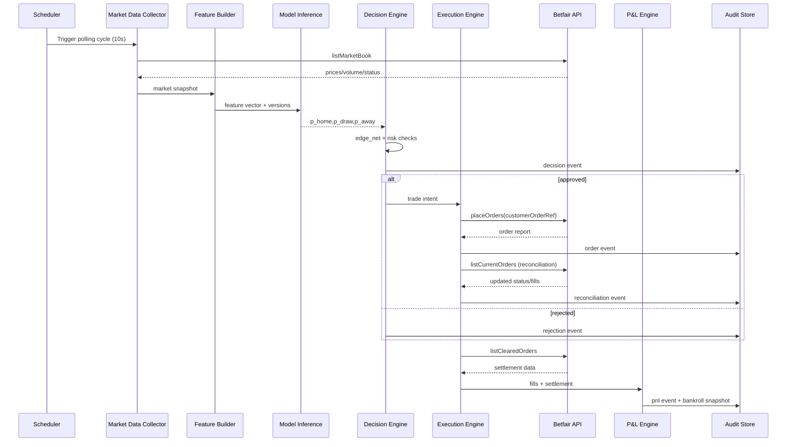

# Market-Inefficiency-Aware Pre-Match Trading on Betfair Exchange: An Audit-First Supervised AI MVP

## Table of Contents
1. Abstract
2. Introduction
3. Related Work
4. Method
   - 4.1 Problem Formulation
   - 4.2 Data and Feature Design (Market, Elo, Form)
   - 4.3 Probability Estimation and Calibration
   - 4.4 Decision Policy and Net Edge
5. System Architecture
   - 5.1 Context and Container View
   - 5.2 Component and Sequence View
   - 5.3 Data Model and Auditability
6. Execution and Risk Management
7. Experimental Protocol
   - 7.1 Temporal Splits and Leakage Prevention
   - 7.2 Predictive and Trading Metrics
   - 7.3 Ablation (A0/A1/A2)
8. Limitations and Ethics
9. Conclusion
10. References

---

## 1. Abstract
This paper presents an engineering-focused Minimum Viable Product (MVP) for supervised AI trading on Betfair Exchange football markets, limited to pre-match Match Odds (1X2). The system estimates calibrated class probabilities $(p_{home}, p_{draw}, p_{away})$ using exchange microstructure signals and external baseline features (Elo and recent form), then executes trades only when estimated net edge is positive after costs. The design prioritizes reproducibility, operational safety, and full auditability: every decision, input feature snapshot, model output, order lifecycle event, settlement event, and bankroll update is stored in append-only logs. We define a default MVP operating window (T-120 to T-10 minutes before kick-off), polling cadence (10 seconds), and risk policy (fractional Kelly 0.25, 2% per-market cap, 5% daily stop, max one position per event). We also provide an evaluation protocol with strict out-of-time validation and explicit leakage controls for Elo/form computation. The architecture targets practical deployment learning under controlled risk, with transparent pathways for model and execution improvements.

## 2. Introduction
Exchange betting markets are often close to informational efficiency, but temporary pre-match dislocations can still appear due to liquidity shifts, asynchronous information incorporation, and participant heterogeneity. The central problem is to identify and monetize these deviations while constraining operational and financial risk.

The proposed MVP is intentionally narrow:
- sport: football,
- market: Match Odds 1X2,
- mode: pre-match only.

This narrowing supports three objectives:
1. **Reliable execution semantics** in a stable time regime versus in-play volatility.
2. **Clean model attribution** by reducing strategy complexity.
3. **Audit-first deployment** with deterministic reconstruction of decisions.

The practical contribution is not a novel learning algorithm; it is a full-stack, production-ready specification aligning ML estimation, exchange execution, and risk governance in a single coherent system.

## 3. Related Work
Prior practical literature for exchange trading emphasizes three recurring themes: (i) extracting signal from market microstructure, (ii) careful handling of exchange fees/frictions, and (iii) robust operational workflows for order lifecycle management. Public materials from Betfair data science and API documentation strongly suggest that implementation details (catalog discovery, order status handling, settlement reconciliation) are as critical as modeling quality.

In sports forecasting, Elo-style ratings remain a robust, interpretable baseline for team strength priors. Short-term form aggregates can complement Elo by capturing recency effects not fully reflected in long-run ratings. However, temporal leakage is a known risk; feature computation must be strictly as-of each decision timestamp.

This work combines these strands in an operational MVP blueprint where model quality, execution realism, and audit traceability are treated as first-class and co-equal concerns.

## 4. Method

### 4.1 Problem Formulation
For each eligible pre-match market instance at timestamp $t$, estimate outcome probabilities:
$$
\hat{\mathbf{p}}_t = (\hat{p}_{home,t}, \hat{p}_{draw,t}, \hat{p}_{away,t}), \quad \sum_i \hat{p}_{i,t}=1
$$

Given market-implied probabilities $\mathbf{p}^{market}_t$ and estimated transaction costs, decide whether to place an order on one outcome side under risk constraints.

### 4.2 Data and Feature Design (Market, Elo, Form)
The feature space is built from two families:

1. **Exchange-derived features**
   - best back/lay price proxies,
   - spread and traded volume indicators,
   - liquidity concentration and short-horizon pre-match dynamics.

2. **External baseline features (Option 1)**
   - Elo ratings (home/away, delta),
   - recent form windows (N=5 and N=10), computed as-of timestamp.

As-of correctness is strict: Elo and form for a market at time $t$ can only use matches finalized before $t$.

### 4.3 Probability Estimation and Calibration
Any supervised multiclass estimator may be used in MVP, provided it outputs class probabilities. Calibration is mandatory (e.g., post-hoc calibration layer) and tracked by model version. The system stores:
- model artifact/version,
- feature set version,
- calibration metadata,
- inference timestamp.

### 4.4 Decision Policy and Net Edge
For outcome $i \in \{home, draw, away\}$:

1. Build raw market-implied probability from executable odds proxy:
$$
	ilde{p}_{market,i} = 1/odds_i
$$

2. Normalize across outcomes:
$$
p_{market,i} = \frac{\tilde{p}_{market,i}}{\sum_j \tilde{p}_{market,j}}
$$

3. Compute gross and net edge:
$$
edge_{gross,i} = \hat{p}_{model,i} - p_{market,i}
$$
$$
edge_{net,i} = edge_{gross,i} - cost_{commission,i} - cost_{slippage,i}
$$

Trade condition (MVP default):
- $edge_{net,i} \ge \theta$,
- liquidity and spread filters pass,
- time is within T-120 to T-10,
- risk limits and health checks pass.

## 5. System Architecture

### 5.1 Context and Container View
The MVP architecture is organized into modular services for data intake, inference, policy, execution, accounting, and control.

```mermaid
flowchart TB
    subgraph External
      BF[Betfair Exchange API]
      BH[Betfair Historical Data]
      EXT[External Results Provider]
    end

    subgraph MVP
      MDC[Market Data Collector]
      EDI[External Data Ingestor]
      FB[Feature Builder]
      MI[Model Inference]
      DE[Decision Engine]
      EX[Execution Engine]
      PE[P&L Engine]
      CFG[Config/Kill Switch]
      AUD[(Ledger/Audit Store)]
      OBS[Observability]
    end

    BF --> MDC
    BH --> FB
    EXT --> EDI
    MDC --> FB
    EDI --> FB
    FB --> MI
    MI --> DE
    DE --> EX
    EX --> BF
    EX --> PE
    CFG --> DE
    CFG --> EX

    MDC --> AUD
    FB --> AUD
    MI --> AUD
    DE --> AUD
    EX --> AUD
    PE --> AUD

    MDC --> OBS
    MI --> OBS
    DE --> OBS
    EX --> OBS
    PE --> OBS
```

### 5.2 Component and Sequence View
Core runtime sequence for each polling cycle:
1. Discover/refresh eligible pre-match markets.
2. Poll market book every 10 seconds.
3. Build as-of features and infer calibrated probabilities.
4. Evaluate net edge and risk gates.
5. Submit order intent; reconcile status and fills.
6. On settlement, compute realized net P&L and update bankroll snapshot.

### 5.3 Data Model and Auditability
The architecture enforces append-only records for all lifecycle stages. Correlation keys include:
- `market_id`, `event_id`, `runner_id`,
- `decision_id` (decision root key),
- `customerOrderRef` (order idempotency/reconciliation key),
- `model_version`, `feature_set_version` (reproducibility keys).

This enables deterministic replay from market snapshot to final bankroll delta.

## 6. Execution and Risk Management
The execution stack uses explicit intent records and reconciliation loops to avoid hidden state transitions.

MVP risk defaults:
- fractional Kelly multiplier: 0.25,
- max stake per market: 2% bankroll,
- daily stop-loss: 5% bankroll drawdown,
- max one open position per event,
- operator kill switch to immediately block new entries.

Risk gates are applied before order routing and persisted in decision audit logs. If any hard gate fails, no order is submitted.

## 7. Experimental Protocol

### 7.1 Temporal Splits and Leakage Prevention
Evaluation uses strict out-of-time partitioning (train/validation/test by chronology). Random shuffling is disallowed. Elo and form are computed only from completed matches strictly preceding each as-of timestamp.

### 7.2 Predictive and Trading Metrics
Predictive metrics:
- multiclass log loss,
- Brier score,
- calibration error (ECE).

Trading metrics:
- net ROI,
- max drawdown,
- profit factor,
- distribution of daily returns.

All trading metrics are net of modeled commission and slippage.

### 7.3 Ablation (A0/A1/A2)
- **A0**: market-only features.
- **A1**: market + Elo.
- **A2**: market + Elo + form (N=5, N=10).

Each step changes one feature family while holding split strategy, cost model, and policy constants fixed.

## 8. Limitations and Ethics
Limitations:
- pre-match-only scope reduces opportunity breadth,
- external data quality and entity resolution can degrade signal,
- no dynamic hedge in MVP implies potentially higher variance,
- model may miss qualitative factors (lineups/news) not represented in baseline features.

Ethical and governance considerations:
- maintain transparent decision logs and post-incident accountability,
- enforce conservative risk controls to reduce harmful over-exposure,
- clearly separate experimentation from production bankroll escalation.

## 9. Conclusion
This paper defines a deployment-oriented MVP for AI-assisted pre-match trading on Betfair Match Odds 1X2. The main contribution is a coherent engineering specification where supervised probability modeling, exchange execution, risk controls, and append-only auditability are integrated end-to-end. The framework is intentionally conservative and testable, enabling progressive improvement through ablation and controlled live experimentation.

## 10. References
- Betfair Data Scientists guide: https://betfair-datascientists.github.io/
- Betfair Exchange API reference (`listMarketBook`, `placeOrders`, `listMarketCatalogue`, `listCurrentOrders`, `listClearedOrders`): https://developer.betfair.com/exchange-api/
- Betfair Historical Data Services API: https://historicdata.betfair.com/
- Betfair Commission documentation: https://support.betfair.com/